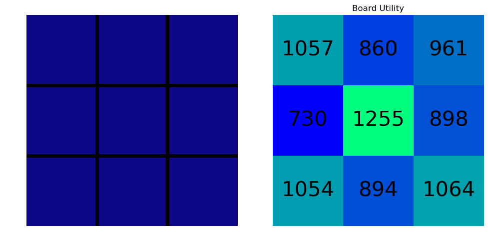

# Tic-Tac-Toe Algorithm Trained with Reinforcement Learning

> Joseph P. Vantassel, The University of Texas at Austin

## Executive Summary

This repository includes Python modules for developing a memory-based
tic-tac-toe playing algorithm using reinforcement learning.

The repostory includes two modules of interest `train.py` and `play.py`. _Note:
The other modules contain functions to support these two main modules._

- `train.py` is for training new memory sets, and is discussed [here](#Training-New-Memory-Sets)
- `play.py` is for a human player to interact with a previously trained memory
set, and is discussed [here](#Playing-Against-a-Trained-Memory-Set).

During its development and testing the programs in this repository have been
used to answer a few questions of interest to the author (e.g., what is the best
first move in tic-tac-toe). The questions and answers are provided at the
bottom of this document [here](#A-Few-Interesting-Questions).

## Getting Started

1. Install Python 3.7 or any later version. If you would like
detailed instructions for installing a modern Python interpreter you may find
[this](https://github.com/jpvantassel/python3-course/blob/master/0_Getting_Started/installing_python.md)
helpful.
2. Download and unzip this repository.
3. Open command line in the unzipped repository, and install the necessary
dependicies by entering `pip install requirements.txt`into the command line.
_Note: If using a modern Windows machine the Windows Powershell is the
recommended command line interface, however the Command Prompt may also be
used._
4. Run either the training or playing module by entering `python train.py` or
`python play.py` (recommended) into the command line.
5. Follow the command line prompts to make run specific selections. _Note:
Additional (i.e., non-standard) settings that allow for more complex behavior
are provided as hard-coded inputs in both `train.py` and `play.py`._
6. Enjoy!

## Training New Memory Sets

The computer's ability to play tic-tac-toe is based solely on its previous
experience (i.e., previous games in which it has either won, lost, or drawn).
So for the computer to become sufficiently proficient so as to stand a chance
against a human, it must be trained by playing many, many games. This training
may be done with a human player, though this is rather tedious for the human
player, or it may be trained against another machine, which is the option
utilized here. The training is done by performing some number of simulations
(i.e., `number_simulation`), where each simulation is considered a game of
tic-tac-toe. After each game the moves of the winning player are rewarded and
the losing player are punished. As training proceeds games may or may not
consider these punished or rewarded behaviors. The result of the training stage
is a memory set that can be recalled in later games. Some simple pre-trained
sets have already been provided for your convenience.

## Playing Against a Trained Memory Set

Playing against a trained memory set is rather simple, and four pre-trained sets
of varying difficulty (i.e., easy, medium, hard, and impossible) have already
been provided and are accesible throught the command line interface. To use
your own trained memory set, simply change the variable `file_name_p1` or
`file_name_p2` depending upon whether the computer is playing as player 1 or
player 2, respectively.

## A Few Interesting Questions

During its development and testing this program has been used to answer a few
questions of interest to the author. This sections is used to summarize the
author's conclusion on the questions considered.

### If both players play at random, what is the most advantageous first move

To investigate this a training session of 10,000 models was post-processed using
the jupyter notebook `vis_training.ipynb`. Figure 1 shows the board state
considered (i.e., empyt board) on the left and the assigned utility to each move
on the right.

__Figure 1:__ Board state considered (left) and utility of each move (right).
Higher utility defines a more advantageous/desirable move.

From Figure 1 the central cell is the most desirable move, followed by the
four corner cells, and then the remaining four interior cells.

### If both players play at random, what is the probability of a win, loss, or draw

To investigate this in detail five different trainings each using a different
number of simulations were performed. For each simulation both player 1 and
player 2 played randomly (i.e., the results of previous games were not
used/recalled when selecting the next move). However, indirect learning at the
end of each game was used to expedite the learning process. Table 1 summarzines
the results.

__Table 1:__ Summary of win/loss/draw for five trainings when Player 1 and
Player 2 were plaing randomly.

| Number of Simulations | Player 1 Wins (%) | Player 2 Wins (%) | Game is Tied (%) |
|:---------------------:|:-----------------:|:-----------------:|:----------------:|
|     100               | 57.0              | 35.0              | 8.0              |
|   1,000               | 55.0              | 31.6              | 13.4             |
|  10,000               | 58.4              | 29.1              | 12.4             |
|  50,000               | 58.2              | 29.0              | 12.8             |
| 100,000               | 58.5              | 28.8              | 12.7             |

Table 1 clearly shows requardless of the number of simulations considered (i.e.,
robustness of the probability estimate) Player 1 has a distinct advantage
(i.e., ~30%) over Player 2.

Since these are estimates of the true probabilities it is important to quantify
their uncertainty. This was done by performing 10 sets of 10,000 simulations
and considering their solution as a representative sample set of the true
probability. The results are shown in Table 2.

__Table 2:__ Summary of win/loss/draw with uncertainty (i.e., 68 % confidence
interval) from 10 simulations of 10,000 simulations each.

| Player 1 Wins (%) | Player 2 Wins (%) | Game is Tied (%) |
|:-----------------:|:-----------------:|:----------------:|
| 58.9 +/- 0.6      | 28.6 +/- 0.6      | 12.5 +/- 0.5     |

Table 2 confirms that the uncertianty in the simulation is not signficant enough
to confound the previous conclusion that when both players play randomly Player
1 enjosy a ~30% advantage over Player 2.
